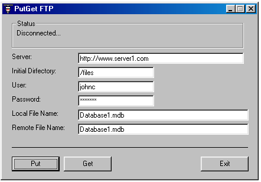

<div align="center">

## GetPut FTP


</div>

### Description

PutGet FTP is a simple app that uses only the very required API's to upload or download files from an FTP Server. NO CLASS Required, easy to understand. It's useful to implement update services between applications and web sites.
 
### More Info
 
Server, directory, user, password, file to download or upload

NO CLASS Required, easy to understand. It's useful to implement update services between applications and web sites.

download or upload a file to an FTP Site,


<span>             |<span>
---                |---
**Submitted On**   |2003-05-26 00:16:14
**By**             |[JMoreno](https://github.com/Planet-Source-Code/PSCIndex/blob/master/ByAuthor/jmoreno.md)
**Level**          |Advanced
**User Rating**    |4.4 (22 globes from 5 users)
**Compatibility**  |VB 5\.0, VB 6\.0
**Category**       |[Internet/ HTML](https://github.com/Planet-Source-Code/PSCIndex/blob/master/ByCategory/internet-html__1-34.md)
**World**          |[Visual Basic](https://github.com/Planet-Source-Code/PSCIndex/blob/master/ByWorld/visual-basic.md)
**Archive File**   |[GetPut\_FTP1592505262003\.zip](https://github.com/Planet-Source-Code/jmoreno-getput-ftp__1-45724/archive/master.zip)

### API Declarations

```
Public Declare Function InternetOpen Lib "wininet.dll" Alias "InternetOpenA" (ByVal sAgent As String, ByVal lAccessType As Long, ByVal sProxyName As String, ByVal sProxyBypass As String, ByVal lFlags As Long) As Long
Public Declare Function InternetConnect Lib "wininet.dll" Alias "InternetConnectA" (ByVal hInternetSession As Long, ByVal sServerName As String, ByVal nServerPort As Integer, ByVal sUsername As String, ByVal sPassword As String, ByVal lService As Long, ByVal lFlags As Long, ByVal lContext As Long) As Long
Public Declare Function FtpSetCurrentDirectory Lib "wininet.dll" Alias "FtpSetCurrentDirectoryA" (ByVal hFtpSession As Long, ByVal lpszDirectory As String) As Boolean
Public Declare Function FTPPutFile Lib "wininet.dll" Alias "FtpPutFileA" (ByVal hFtpSession As Long, ByVal lpszLocalFile As String, ByVal lpszRemoteFile As String, ByVal dwFlags As Long, ByVal dwContext As Long) As Boolean
Public Declare Function InternetCloseHandle Lib "wininet.dll" (ByVal hInet As Long) As Long
Public Declare Function FTPGetFile Lib "wininet.dll" Alias "FtpGetFileA" (ByVal hFtpSession As Long, ByVal lpszRemoteFile As String, ByVal lpszNewFile As String, ByVal fFailIfExists As Boolean, ByVal dwFlagsAndAttributes As Long, ByVal dwFlags As Long, ByVal dwContext As Long) As Boolean
```


